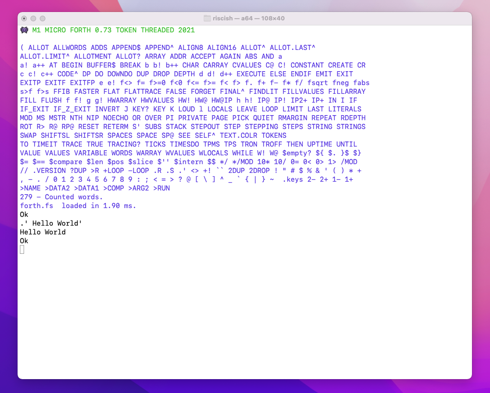

# 👾 M1 MICRO FORTH 0.73 

##### (TOKEN THREADED) 2022

### Inspiration

Inspired by FORTH, especially micro computer FORTHs of the 1980s.

### purpose

Learn ARM64, have fun, create useful things.

Provide a small safe subset of user friendly FORTH (if possible.)

### now in testing phase

- The write a small FORTH in 10,000 lines of assembly or less, is complete.

- The write ten thousand lines of FORTH to test the small FORTH works correctly and safely is now in progress.

- The application is running in the terminal for now.

    - I find running things in a game loop, is a really good way to test they work, so I am writing some dumb terminal games.

- During this phase I also plan to rewrite some of the brutally stupid 'algorithms' in the interpreter.
    - Any that waste shed loads of memory, or are slow.

I plan to add sound and 2D sprites and escape from the terminal, in the next phase after this.

After that I will finally be able to program aß Mac like it is a micro-computer again.


###  M1 MICRO FORTH - a small, simple, non-standard Forth


#### Features 


Aims to provide a small safe set of user/application level words.

- Strings  
    - ASCII in this version.
    - string storage has its own pool, a string literal looks like  `' a string '`. 
    - string words start with $ e.g ```$.``` prints a string.
    - zero terminated.
    - There are words to name strings
        - ```' Hello World' STRING hello_world```
    - There are words to build new strings (from substrings)
        - ```${ ' ${ starts ' , ' appending ' , ' $} finishes ' , $} STRING appender ```
    - I am trying to make strings safe to use.
- The dictionary is simplified into a single array for the headers :-
    - There are no vocabularies, a few hundred words are defined not thousands.
    - Headers are seperated from 'code' (tokens), literals, and data.
- The token space for 16bit tokens (compiled words) is separate from data.
    - The token compiler creates tokens in token space and literals in literal pools.
- Values are used and several value sizes are supported.
    - Values are safer as you do not work with raw addressess.
    - Values are more convenient when most access is read access.
    - Arrays of values are supported.
- Locals 
    - A simple and efficient LOCALS implementation.
- Introspection
    - Running words can look up their own dictionary entry with SELF^  
    - This allows words to look up their own name, data, and code.
- Loops
    - The usual loop constructs
- DO LOOP
    - higher lower DO ... LOOP 
    - higher lower DO ... +LOOP
    - higher lower DOWNDO ... LOOP
    - higher lower DOWNDO ... -LOOP
    - LEAVE is only available once inside each loop.
- Indefinite loops
    - BEGIN f UNTIL
    - BEGIN .. f WHILE .. REPEAT
    - BEGIN .. f IF LEAVE THEN.. AGAIN 
- I/O
    - Unix terminal KEY, EMIT, KEY?, NOECHO, RETERM (restore terminal)
    - Simplified ACCEPT to read lines
    - ``` $'' STRING user_name  ACCEPT TO user_name .' Hi ' user_name $. CR ```
- The interpreter
    - is mostly implemented in ARM64 assembly language.
    - uses a slot for run time and compile time primitives in each words header.
    - compiles words to a token list using half-word (16 bit tokens)
    - longer literals are shared accross words and replaced with references to literal pools.
    - Often compile time words, compile a helper function named (nnnnn)
    - each high level word calls its own machine code interpreter 
    - there are several versions of the interpreter.
- Introspection
    - There are words to SEE words, and to trace word execution.
    - There are values that are views over the various storage pools.
    - It is possible to STEP through words.

### Selfie



### Details

[M1MicroForth.md](M1MicroForth.md)

##### Project rules

This is open source, feel free to fork and improve.

This project does not accept pull requests.


### Building

For OSX first get Xcode from the app store, and install the command line tools.

The build uses the assembler and the c compiler.

Then run **make** in a terminal to generate the executable **mf**


