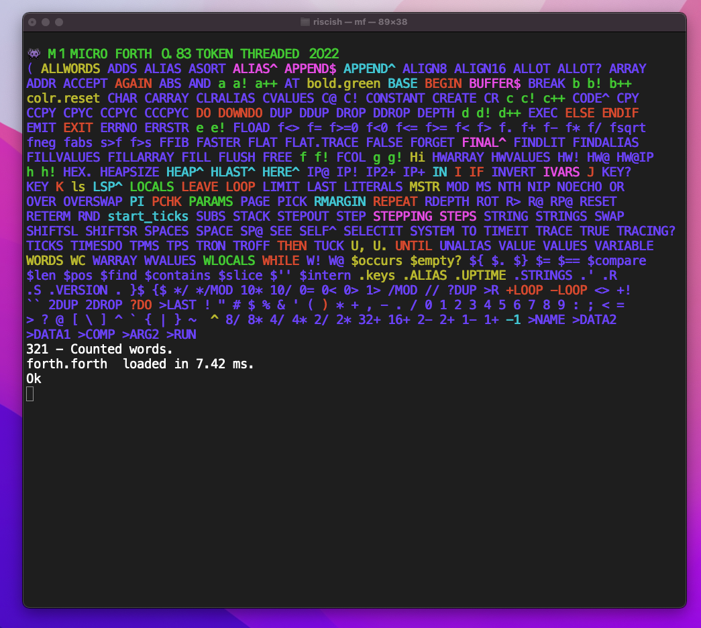

# 👾 M1 MICRO FORTH  

##### (TOKEN THREADED) 2022

### Inspiration

Inspired by FORTH, especially the micro computer FORTHs of the 1980s.

### purpose

Learn ARM64, have fun, create useful things.ßß

Provide a small safe subset of user friendly FORTH (if possible.)

### now in testing phase

- The "write a small FORTH in 10,000 lines of assembly or less", is almost complete.

- The write "ten thousand lines of FORTH to test the small FORTH works correctly and safely" is planned next.

- The application is running in the terminal for now.

- There has been a months long delay since easter thanks to persistent 'brain fog' from mild Covid.


###  M1 MICRO FORTH - a small, simple, non-standard Forth

Runs on the Mac Mini M1 under OSX.

#### Features 


Aims to provide a small safe set of user/application level words.

- Strings  
    - ASCII in this version. Zero terminated.
    - string storage has its own pool, a string literal looks like  `' a string '`. 
    - string words start with $ e.g ```$.``` prints a string.
    - identical strings are interned in the pool once.
    - There are words to name strings
        - ```' Hello World' STRING hello_world```
    - There are words to build new strings (from substrings)
- The dictionary is simplified into a single array for the headers :-
    - There are no vocabularies, a few hundred words are defined not thousands.
    - Headers, Token Code, Literals and Data use seperate storage areas.
    - Literals are stored in various literal pools.
- VALUES are used and several value sizes are supported.
    - Values are safer as you do not work with raw addressess.
    - Values are more convenient when most access is read access.
    - Arrays of values are supported.
- LOCALS 
    - A simple LOCALS implementation is used.
- Introspection
    - Running words can look up their own dictionary entry with SELF^  
    - This allows words to look up their own name, data, and code.
- Loops
    - The usual loop constructs, with some limitations.
- DO LOOP
    - higher lower DO ... LOOP 
    - higher lower DO ... +LOOP
    - higher lower DOWNDO ... LOOP
    - higher lower DOWNDO ... -LOOP
    - LEAVE  is for the moment only available *once* inside each loop.
- Indefinite loops
    - BEGIN f UNTIL
    - BEGIN .. f WHILE .. REPEAT
    - BEGIN .. f IF LEAVE THEN.. AGAIN 00
    - LEAVE and WHILE are only available *once* inside each loop.0
- I/O
    - Unix terminal KEY, EMIT, KEY?, NOECHO, RETERM (restore terminal)
    - Simplified ACCEPT used to read lines
    - ``` $'' STRING user_name  ACCEPT TO user_name .' Hi ' user_name $. CR ```
- The Interpreter
    - is mostly implemented in ARM64 assembly language.
    - some C and use of standard C library.
    - uses a slot for run time and compile time primitives in each words header.
    - compiles words to a token list using half-word sized (16 bit) tokens.
    - longer literals are shared accross words and interned in literal pools.
    - each high level word calls its own interpreter 
- Inspection
    - There are words to SEE words, and to trace words.
    - It is possible to STEP through words.
- Memory storage
    - The least powerful target system has 8GB of memory
    - Memory for words and data is allocated, and resized dynamically.
- Word redefinition 
    - :: redefines an existing word.


### Selfie



### Details

[M1MicroForth.md](M1MicroForth.md)

##### Project rules

This is open source, feel free to use, fork, improve.

This project does not accept pull requests.


### Building

For OSX first get Xcode from the app store, and install the command line tools.

The build uses the assembler and the c compiler.

Then run **make** in a terminal to generate the executable **mf**


### Font

I use this nice font:

[https://github.com/dokutan/legacy_computing-font](Legacy computing symbols)

This font includes useful shapes for terminal graphics
